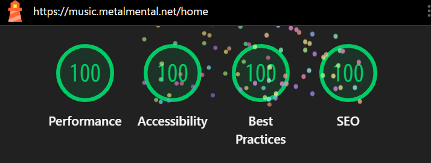

## Install

node version: v24

```bash
# 初回 (※cd不要)
npm install

# 外部ライブラリ追加時はfrontendとbackend個別にinstallが基本
## frontendに追加する場合
npm install xxx --workspace frontend
## backendに追加する場合
npm install xxx --workspace backend
```

## Deploy

初回デプロイ時
1. Route53へのレコード追加が必要
2. frontendのenvファイルにuserPoolやidentityPoolの設定が必要
3. 音楽アップロード用のAdminユーザはCognitoコンソール画面から作成

詳しくはCodeBuildを参照

### Backend

```bash
npm run cdk --workspace=backend -- deploy --all --parallel --ci --require-approval never --context env=dev
npm run cdk --workspace=backend -- deploy --all --parallel --ci --require-approval never --context env=prod
```

### Frontend

viteのbuildの仕組みを利用し環境分離

`vite build --mode <env>`

- `.env.dev`
- `.env.prod`

```bash
npm run build --workspace=frontend -- --mode dev
npm run build --workspace=frontend -- --mode prod
```

### Local

`.env.local` ファイルを作成し、以下dev環境のdomainに接続するよう環境変数を設定して起動する

```ini
VITE_MEDIA_HOST=https://dev-music.metalmental.net
```

```bash
# devモードで起動するよう設定されています
npm run dev --workspace=frontend

# 以下で本番環境同様の動作確認が可能
npm run build --workspace=frontend -- --mode dev
npx serve frontend/dist --single --listen 5173
```

## 負債

- 次回はSSGを意識したアプリを作成する
  - 画面をリロードした際にダークモードに変化する際のちらつきが防げない
  - GitHub UIのような再レンダリングされていないように見せる方法ができない
  - GraphQLは認証必須で公開APIには向かないし、Subscription (Websocket) は初期化処理が重いため、リアルタイムの必要性がなければ利用しない

# Backend

## Rule

1. 作成するAWSリソースは `public readonly` でフィールに定義
2. AWSリソース名は `cdk.Stack.of(this).stackName.toLocaleLowerCase()` を利用
3. 環境変数は `env` に定義

# frontend

## Deploy

```bash
npm run build --workspace=frontend
```

## アーキテクチャ

基本的なアーキテクチャは [PopCal](https://flupinochan.github.io/popcal-document/docs/architecture/core/overview) Flutterアプリと同様な構成

## フォルダ構成

```yaml
src/
├── domain/
│   ├── entities/       # ロジック
│   ├── gateways/       # DB等以外の外部API呼び出し (Interface)
│   ├── repositories/   # entityをDB等に保存し永続化 (Interface)
│   ├── services/       # 複数のentityにまたがるロジック
│   ├── value_objects/  # primitive型の代わり
├── infrastructure/
│   ├── dto/            # infrastructure側で利用するデータ型
│   ├── mappers/        # dto, entityの変換処理
│   ├── repositories/   # 実装
│   └── gateways/       # 実装
├── presentation/
│   ├── dto/            # UI側で利用するデータ型
│   ├── mappers/        # dto, entityの変換処理
│   ├── stores/         # 状態管理
│   └── view/           # UI
└── use_cases/          # repository、gateway、serviceを利用したdomain層の複合処理、UIからのdto requestをmapperでentityに変換しつつ各domain処理を呼び出す。responseもmapperでentityからdtoに変換して返却
```

## 型について

### ドメイン層で利用してよい型

- [プリミティブ型](https://typescriptbook.jp/reference/values-types-variables/primitive-types)
  - boolean
  - number
  - bigint
  - string
  - symbol
- [標準の組み込みオブジェクト](https://developer.mozilla.org/ja/docs/Web/JavaScript/Reference/Global_Objects)
  - Array
  - ArrayBuffer
  - Date
- [WHATWG (URL)](https://ef-carbon.github.io/url/globals.html)
  - 組み込みオブジェクトではないが、browserおよびNode.jsどちらでも利用可能なためOK

### ドメイン層で利用してはいけないbrowser or Node.js依存の型

- File (Blob)、HTMLElement、fetch: browser依存のためNG
- fs、path: Node.js依存のためNG

## 曲選択ロジック

前提
- queue: 曲のリスト
- index: 現在再生しているqueue曲リストのindex
- history: シャッフル用の再生した曲の履歴

以下のマトリクス図
- シャッフル: 有効/無効
- リピートモード: none/one/all

### 次の曲を選択するロジック

#### シャッフル無効の場合

| リピートモード | 終端でない場合 (index < queue.length - 1) | 終端の場合 (index = queue.length - 1) |
| -------------- | ----------------------------------------- | ------------------------------------- |
| none           | index + 1                                 | undefined (再生しない)                |
| one            | index                                     | index                                 |
| all            | index + 1                                 | 0 (最初の曲に戻る)                    |

---

#### シャッフル有効の場合

| リピートモード | 1曲しかない場合 (queue.length = 1) | 1曲以上ある場合 (queue.length > 1) |
| -------------- | ---------------------------------- | ---------------------------------- |
| none           | undefined (再生しない)             | ランダムにqueueから選択            |
| one            | index                              | index                              |
| all            | index                              | ランダムにqueueから選択            |


### 前の曲を選択するロジック

#### シャッフル無効の場合

| リピートモード | 先頭曲でない場合 (index > 0) | 先頭曲の場合 (index = 0)          |
| -------------- | ---------------------------- | --------------------------------- |
| none           | index - 1                    | undefined (再生しない)            |
| one            | index                        | index                             |
| all            | index - 1                    | queue.length - 1 (最後の曲に戻る) |

#### シャッフル有効の場合

| リピートモード | historyあり                 | historyなし & 先頭曲でない場合 | historyなし & 先頭曲の場合        |
| -------------- | --------------------------- | ------------------------------ | --------------------------------- |
| none           | history[history.length - 1] | index - 1                      | undefined (再生しない)            |
| one            | index                       | index                          | index                             |
| all            | history[history.length - 1] | index - 1                      | queue.length - 1 (最後の曲に戻る) |

## 抽象化について

### howler

抽象化はしない
理由としては、`外部サービスではなく`、あくまでも標準のJavaScriptのWeb Audio APIを扱いやすくしたライブラリだからである
抽象化したいのであれば、最初からhowlerを使用せず、`Web Audio APIを直接利用すべき` である
今回は、Web Audio APIの難易度が高いため、howlerを使う方針とする

### Amplify S3/DynamoDB

抽象化する
外部サービスだから


## Lighthouse



- SPAのためJSファイルが大きくなりやすいが、routerでdynamic importを使用してJSファイルを分割
- vuetifyは巨大な単一のCSSファイルを利用する
  - coreだけ利用して、colorやutilitiesのクラスは独自で必要な分だけ定義する

## 命名規則

### DTO

- xxxRequestDto/xxxInputDto: Request用
- xxxResponseDto/xxxOutput/Dto: Response用
- xxxDto: Request/Response共通用

xxxはメソッドのアクション名に合わせる

## 名前付き引数の定義

dartの名前付き引数のような機能はないため、引数を必ずInterfaceで定義することで対策する
dtoありがちなconstructorだけのclassの場合はclassにせず最初から名前付き引数になるInterfaceをdtoとして利用する
value object classはバリデーションメソッド等があるため、inferfaceにはできないが、引数をinterfaceで定義しておくことで名前付き引数にする

## S3パス構造

```
```

## APIについて

バックエンドは AppSync から API Gateway / REST へ移行しました。フロントエンドでは `fetch` を使って
相対パス `/api` に対して HTTP リクエストを送ります。以下のように `frontend/src/infrastructure/apiClient.ts`
で汎用クライアントを定義し、リポジトリ層がそれを利用してエンドポイントを呼び出します。

```ts
// 例: GET /musicMetadata
const items = await apiClient.get<MusicMetadata[]>('/musicMetadata')
// 例: POST /generateS3PresignedUrl
const { url } = await apiClient.post<{url:string}>('/generateS3PresignedUrl', { key })
```
